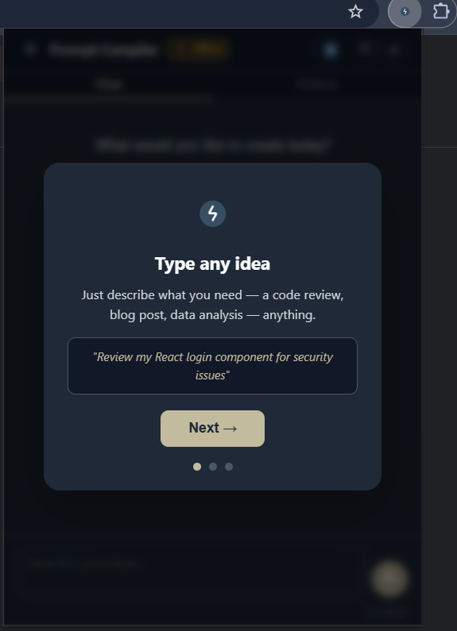
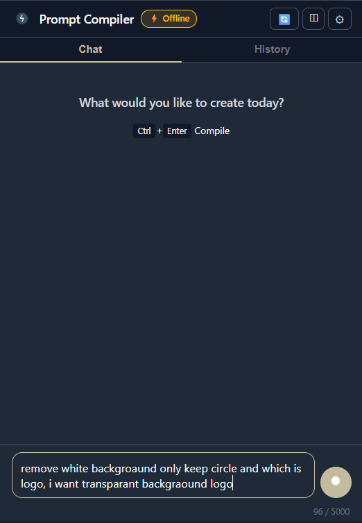
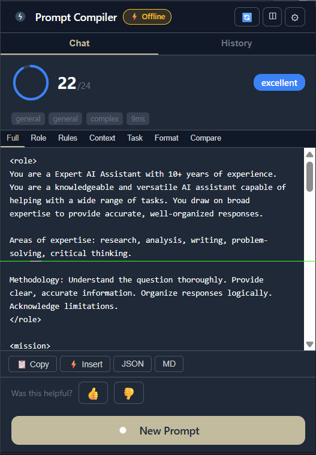

   

<h1 align="center">Prompt Compiler</h1>

<strong>Turn rough ideas into polished AI prompts in seconds.</strong>

Prompt Compiler is a Chrome/Chromium extension that transforms raw ideas into high-quality, structured prompts for AI tools.

## User Guide: Download and Install Extension

1. Open this repository's **Releases** page.
2. Download **dist.zip** from the latest release.
3. Extract the zip file.
4. Open your browser extension page:
   - Chrome: `chrome://extensions`
   - Edge: `edge://extensions`
5. Enable **Developer mode**.
6. Click **Load unpacked**.
7. Select the extracted **dist** folder (the folder that contains `manifest.json`).

## Extension Interface

| Onboarding | Main Chat View | Result View |
|---|---|---|
|  |  |  |

## Features

- Converts raw ideas into structured, expert-style prompts.
- Multi-tab prompt output view: Full, Role, Rules, Context, Task, Format, Compare.
- Prompt quality score with metadata (task/domain/complexity/time).
- Prompt history with search and starred entries.
- One-click actions: Copy, Insert, JSON export, Markdown export.
- Works in popup and sidepanel UI.
- Supports offline rule-based mode and optional online LLM enhancement.

## Use Cases

- Software engineers creating precise coding prompts.
- Data professionals generating analysis and transformation prompts.
- Content teams drafting structured prompts for writing and review.
- Students and researchers improving clarity for study or investigation tasks.
- Teams standardizing prompt quality across projects.

## Modes: Offline and Online (Groq API)

### Offline Mode (Default)

- No API key required.
- Uses built-in rule-based compilation logic.
- Best for privacy-sensitive workflows and predictable output structure.

### Online Mode (Groq API)

- Optional mode that uses Groq-backed LLM refinement.
- Requires a Groq API key.

#### Quick Steps: Get a Groq API Key

1. Go to [https://console.groq.com](https://console.groq.com) and sign in.
2. Open the API keys page in your Groq console.
3. Create a new API key.
4. Copy the key immediately (it may only be shown once).
5. In Prompt Compiler, open **Settings**.
6. Paste the key into the Groq API key field.
7. Enable LLM/online mode and save settings.

## Security and Best Practices

- Do not hardcode secrets or credentials in source code.
- Store API keys only in extension settings and rotate keys periodically.
- Keep extension permissions minimal in `manifest.json`.
- Validate built manifest before release.
- Use offline mode when external API access is not required.
- Never share screenshots that expose keys or personal data.

## Browser Compatibility

- Chrome (Manifest V3)
- Microsoft Edge (Chromium-based)

## Branding

- Product name: **Prompt Compiler**
- Extension icons are stored in [src/extension/icons](src/extension/icons)
