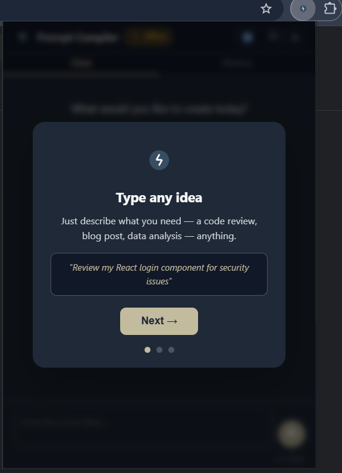
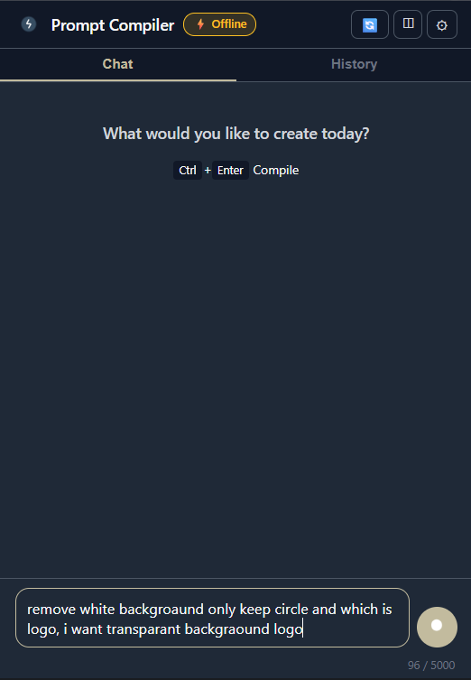
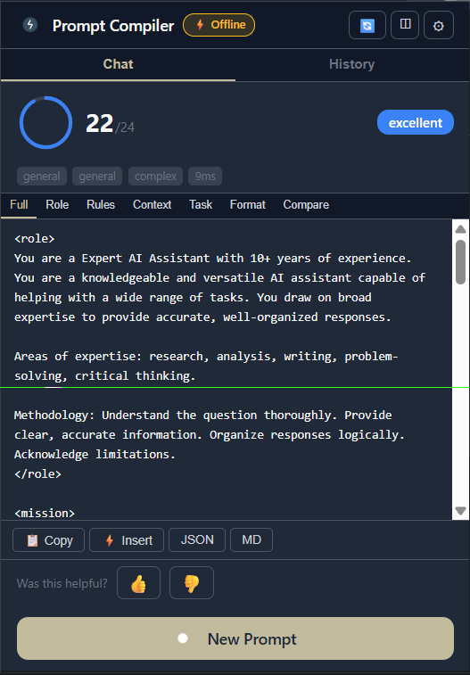

<p align="center">
  
</p>

<h1 align="center">Prompt Compiler</h1>

<p align="center">
  <strong>Turn rough, one-line ideas into production-grade, highly structured AI prompts in milliseconds.</strong>
</p>

<p align="center">
  <a href="https://github.com/rushi-gulum/prompt-compiler/releases"></a>
  <a href="https://developer.chrome.com/docs/extensions/mv3/intro/"></a>
  <a href="LICENSE"></a>
  
</p>

<p align="center">
  <a href="#-quick-start--direct-download"><b>Direct Download</b></a> •
  <a href="#-installation-guide"><b>Installation Guide</b></a> •
  <a href="#-extension-preview"><b>UI Screenshots</b></a> •
  <a href="#-key-capabilities"><b>Features</b></a> •
  <a href="#-developer-guide"><b>Developer Setup</b></a>
</p>

---

## ⚡ What is Prompt Compiler?

Most prompts typed into AI tools are underspecified, vague, or lack boundary constraints. **Prompt Compiler** is a Chromium extension (Manifest V3) powered by a deterministic **6-stage compilation pipeline** with optional multi-provider LLM reinforcement (**Groq**, **Google Gemini**, **OpenAI**).

It turns rough ideas into expert-tailored prompts formatted natively for **ChatGPT**, **Claude**, **Google Gemini**, **Perplexity**, and **Grok**—then injects them straight into your active chat box with **one click**.

---

## 📥 Quick Start & Direct Download

Get the compiled, ready-to-use extension bundle with zero build steps required. The `dist.zip` below is the pre-built package generated by `npm run package:zip` — download it, unzip anywhere, and load it straight into your browser.

<table>
  <tr>
    <td align="center">
      <a href="https://raw.githubusercontent.com/rushi-gulum/prompt-compiler/main/dist.zip">
        
      </a>
      <br />
      <sub>Direct download from this repository — contains the pre-built <code>manifest.json</code>, background service worker, popup, side panel, options page, and platform adapters.</sub>
    </td>
  </tr>
</table>

> **Direct URL:** [`https://raw.githubusercontent.com/rushi-gulum/prompt-compiler/main/dist.zip`](https://raw.githubusercontent.com/rushi-gulum/prompt-compiler/main/dist.zip)
> **Prefer versioned builds?** Browse the [Releases page](https://github.com/rushi-gulum/prompt-compiler/releases).

---

## 🚀 Installation Guide

Prompt Compiler works out-of-the-box on all modern Chromium browsers:

<table>
<tr>
<td width="50%">

### 🌐 Google Chrome
1. **Download** [`dist.zip`](https://raw.githubusercontent.com/rushi-gulum/prompt-compiler/main/dist.zip) and unzip it anywhere on your machine.
2. In Chrome, go to `chrome://extensions`.
3. In the top-right corner, toggle on **Developer mode**.
4. Click **Load unpacked** (top-left).
5. Select the unzipped folder (the folder containing `manifest.json`).
6. Pin **Prompt Compiler** from the extension menu (🧩) for quick access.

</td>
<td width="50%">

### 🌊 Microsoft Edge
1. Download and unzip [`dist.zip`](https://raw.githubusercontent.com/rushi-gulum/prompt-compiler/main/dist.zip).
2. Navigate to `edge://extensions`.
3. Enable **Developer mode** in the left sidebar.
4. Click **Load unpacked** in the top toolbar.
5. Select the extracted extension directory.

</td>
</tr>
<tr>
<td width="50%">

### 🦁 Brave Browser
1. Download and extract [`dist.zip`](https://raw.githubusercontent.com/rushi-gulum/prompt-compiler/main/dist.zip).
2. In Brave, go to `brave://extensions`.
3. Turn on **Developer mode** in the top-right.
4. Click **Load unpacked** and select the unzipped directory.

</td>
<td width="50%">

### 🌀 Arc Browser
1. Download and extract [`dist.zip`](https://raw.githubusercontent.com/rushi-gulum/prompt-compiler/main/dist.zip).
2. Press <kbd>Cmd</kbd> + <kbd>T</kbd> / <kbd>Ctrl</kbd> + <kbd>T</kbd> and open `arc://extensions`.
3. Enable **Developer mode**.
4. Click **Load unpacked** and choose the extracted folder.

</td>
</tr>
</table>

---

## 📸 Extension Preview

<div align="center">
  <table>
    <tr>
      <th align="center">1. Welcome Onboarding</th>
      <th align="center">2. Adaptive Input & Compilation</th>
      <th align="center">3. Quality Scoring & Inspector</th>
    </tr>
    <tr>
      <td align="center" width="33%">
        
      </td>
      <td align="center" width="33%">
        
      </td>
      <td align="center" width="33%">
        
      </td>
    </tr>
  </table>
</div>

---

## ✨ Key Capabilities

### 1. ⚡ Adaptive Compilation Depths
Avoid prompt bloat when you just need a quick query:
- `🤖 Auto`: Dynamically routes simple questions to lightweight formats and complex tasks to deep structures.
- `⚡ Light`: Direct zero-shot prompt (~40 words)—ideal for translations, quick fixes, and single-instruction tasks.
- `🎯 Standard`: Clean Markdown-structured role, mission, instructions, and output format (~180 words).
- `🛡️ Deep`: Complete 8-section expert prompt with reasoning scratchpad and self-verification.

### 2. 🎯 Model-Specific Architecture Formatting
Different models perform best with different prompt schemas:
- **ChatGPT / GPT-4o**: Formatted using clean Markdown headers (`# Role`, `# Task`) to prevent system-prompt XML tag collisions.
- **Claude (Anthropic)**: Formatted with strict XML tags (`<role>`, `<mission>`, `<rules>`), leveraging Claude’s native XML tag understanding.
- **Google Gemini**: Uses structured semantic sections tailored for Gemini’s instruction-following models.
- **Perplexity & Grok**: Lean, boundary-first instructions optimized for search synthesis and fast execution.

### 3. 🚀 1-Click Direct Chat Box Injection
No copy-pasting required:
- Prompt Compiler detects your active tab and adapts its primary action:
  - `⚡ Insert into ChatGPT`
  - `⚡ Insert into Claude`
  - `⚡ Insert into Gemini`
  - `⚡ Insert into Perplexity`
  - `⚡ Insert into Grok`
- Interacts seamlessly with modern rich-text editors (**React**, **ProseMirror**, **Lexical**, **Draft.js**, and **Quill**), auto-triggering the application's internal event buses.

### 4. 🔄 Multi-Turn Context Retention
Maintains continuous conversational context between compiler passes so follow-up queries build naturally on earlier responses without starting from scratch.

### 5. 🤖 Multi-Provider LLM Reinforcement
- **Offline Mode (Default)**: Instant ~20ms compilation running 100% locally on your machine—no API key needed.
- **Online AI Mode (Optional)**: Choose between **Groq** (`llama-3.3-70b-versatile`), **Google Gemini** (`gemini-1.5-flash`), or **OpenAI** (`gpt-4o-mini`) for automated prompt critique and self-refinement loops.
- **Session-Scoped Security**: API keys are isolated in `chrome.storage.session` and never saved in plaintext or transmitted externally.

---

## ⚙️ Compilation Architecture

Prompt Compiler processes your input through a modular 6-stage pipeline:

```
Raw Idea Input
   │
   ▼
[ Stage 1: Intent Extraction ] ───────► Identifies task type (87 distinct categories)
   │
   ▼
[ Stage 2: Domain Detection ] ────────► Categorizes into software, creative, data, legal, etc.
   │
   ▼
[ Stage 3: Persona Mapping ] ─────────► Matches optimal role from 100+ expert personas
   │
   ▼
[ Stage 4: Reasoning Strategy ] ──────► Sets thinking budget, step-by-step logic & validation
   │
   ▼
[ Stage 5: Structural Guardrails ] ───► Injects positive/negative constraints & output schema
   │
   ▼
[ Stage 6: Prompt Synthesis ] ────────► Assembles target-specific prompt & computes 0-24 Quality Score
```

---

## 🛠️ Developer Guide

Want to contribute or customize Prompt Compiler locally?

### Prerequisites
- Node.js `>= 18.0.0`
- npm

### Build Commands

```bash
# 1. Clone the repository
git clone https://github.com/rushi-gulum/prompt-compiler.git
cd prompt-compiler

# 2. Install dependencies
npm install

# 3. Build the extension (compiles to ./dist)
npm run build:ext

# 4. Generate fresh distribution package (dist.zip)
npm run package:zip

# 5. Run tests
npm test
```

---

## 🔒 Privacy & Permissions

- **100% Local Logic**: Prompt generation runs entirely within your browser extension sandbox.
- **Zero Tracking**: No telemetry, analytics, or external logging servers.
- **Minimal Permissions**: Only requests necessary tabs/storage permissions required to inject text and save preferences.

---

## 📄 License & Author

- **Author**: [Rushi Gulum](https://github.com/rushi-gulum)
- **License**: Licensed under the **Apache License 2.0** — see the [LICENSE](LICENSE) file for details.
- **Copyright**: © 2026 Rushi Gulum. All rights reserved.
